# BetPal — Flow Diagrams

## 1. Group Creation

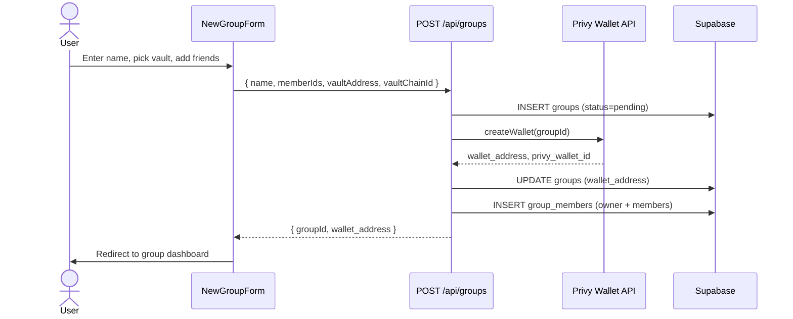

## 2. Deposit (3-Phase)

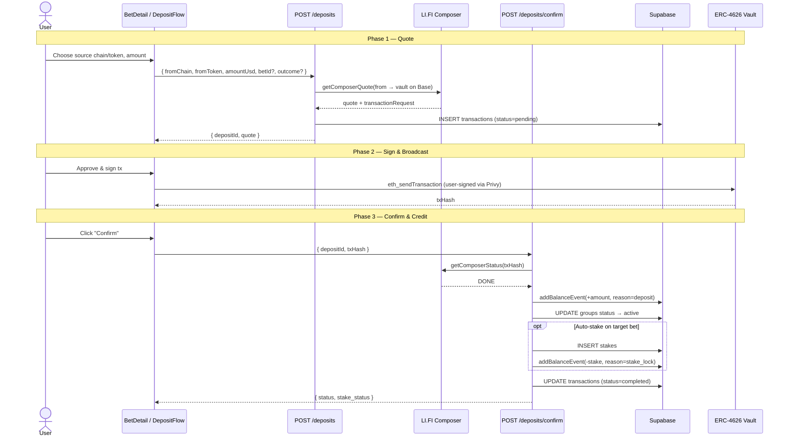

## 3. Bet Creation

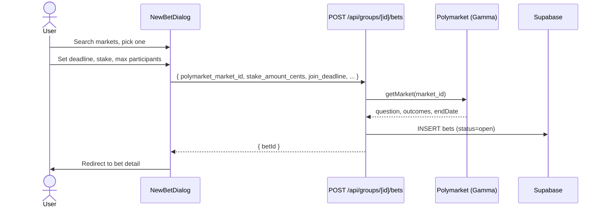

## 4. Placing a Bet (Staking)

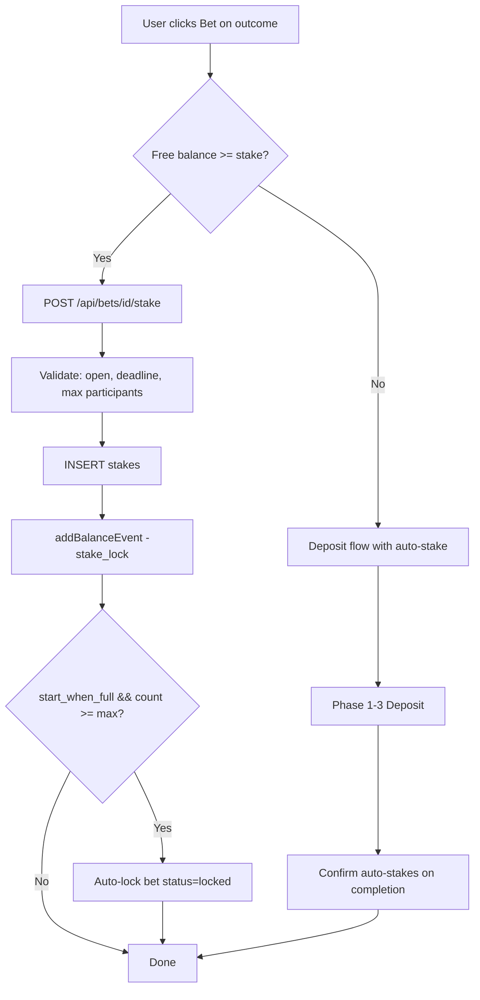

## 5. Bet Resolution

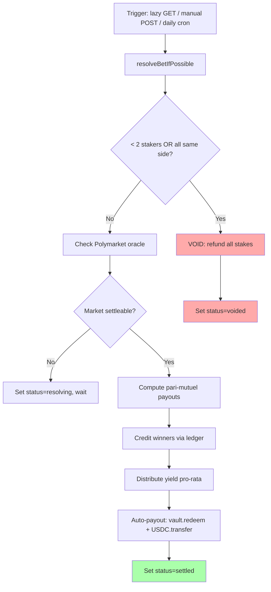

## 6. Force Resolve (Unanimous Consent)

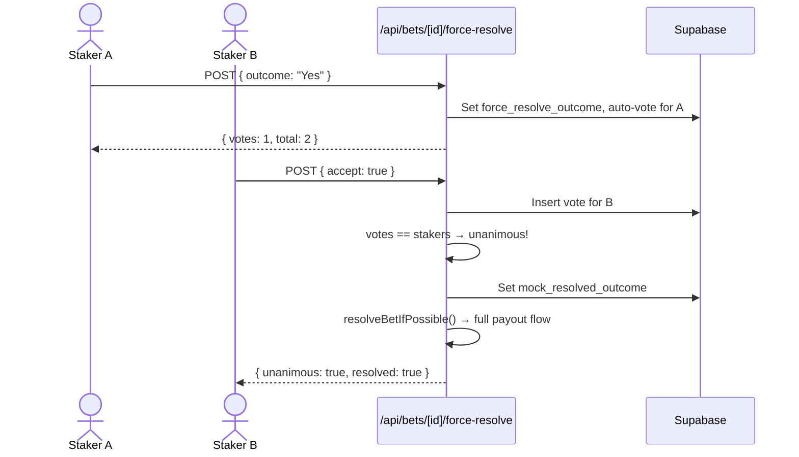

## 7. Cancel Vote (Unanimous Refund)

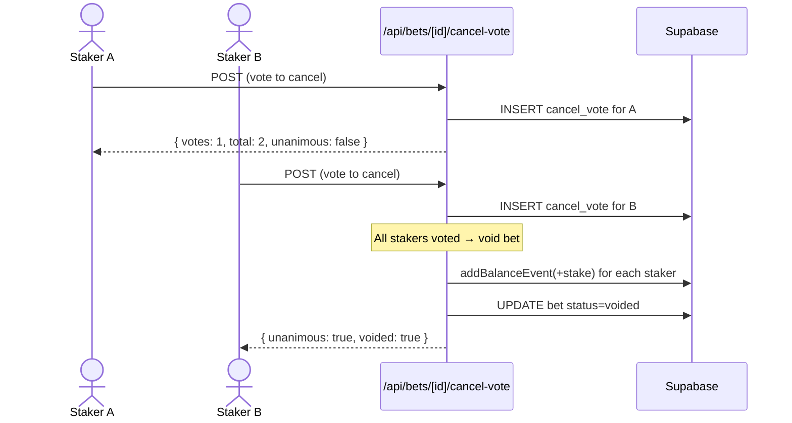

## 8. Withdrawal

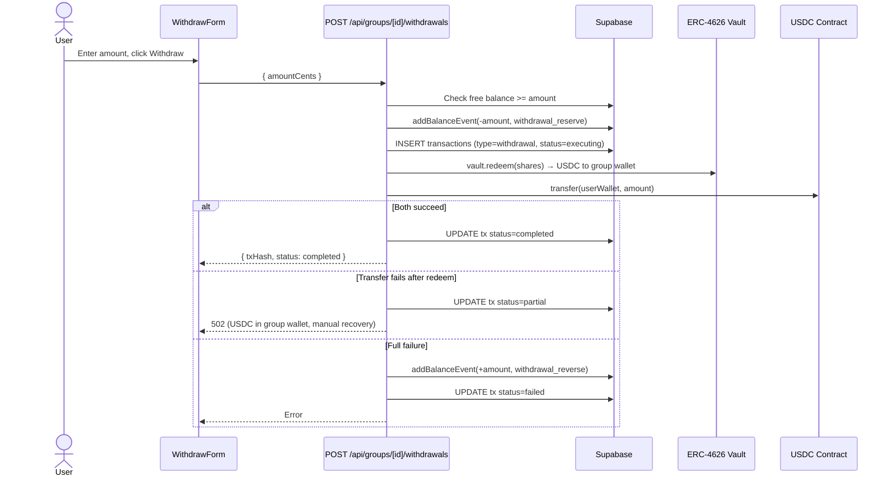

## 9. Vault Switching (4-Eye Approval)

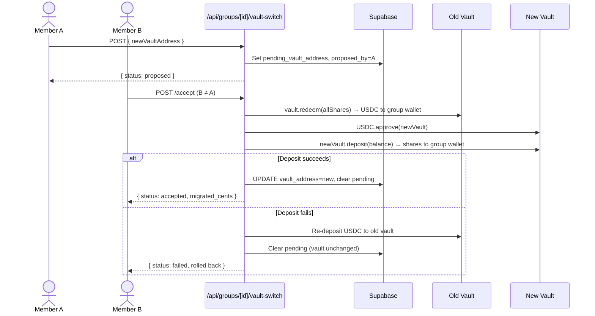

## 10. Invite Flow

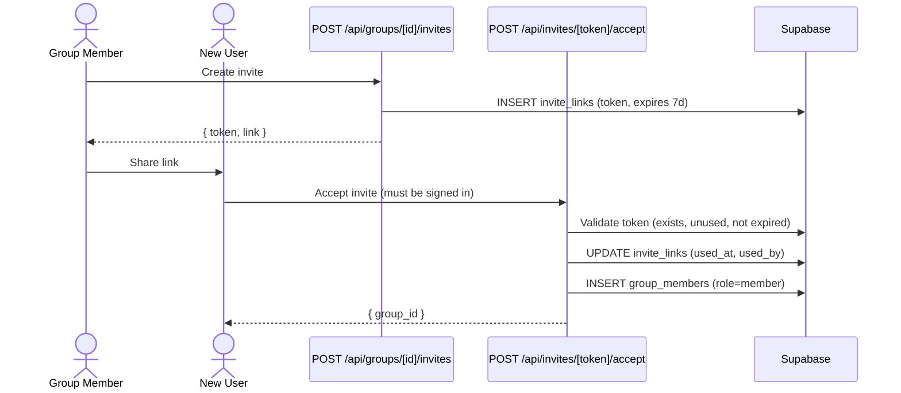

## 11. Overall System Architecture

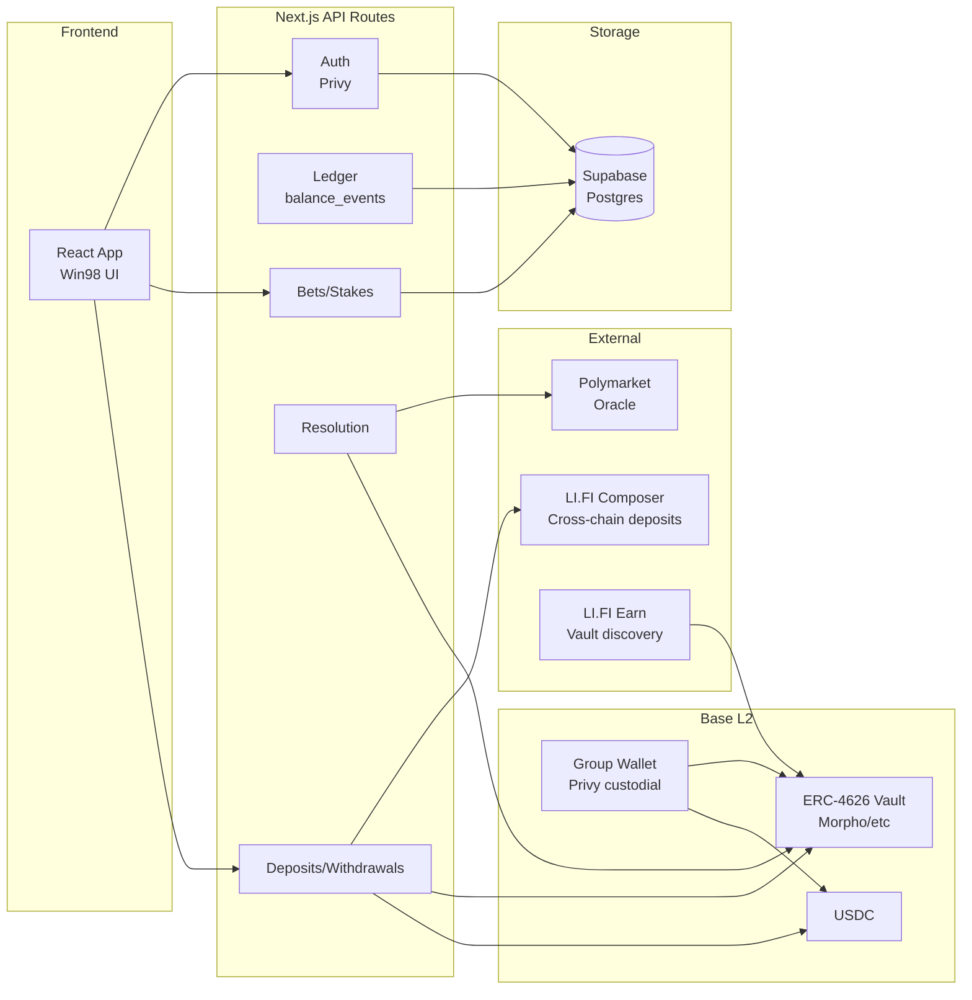
